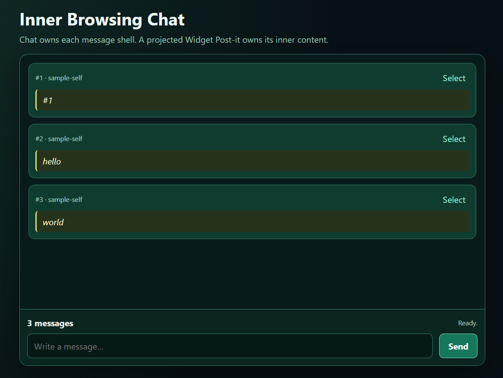

# Inner Browsing

## Introduction

**Inner Browsing** is a server-led model for lifecycle-managed applets. Its
distinguishing choice is not merely that the server sends data to browser
components. The server maintains the structural application, owns the state
from which browser changes follow, and gives every applet a server companion
as well as a client companion.

The browser remains responsible for DOM materialization and interaction. It is
not required to rediscover application structure, reconstruct authoritative
state, or carry business operations between unrelated UI elements. It consumes
ordered server snapshots and reconciles local HTML against them.

### 1. Every client applet has a server-side companion

Every registered applet definition provides a server companion and a client
companion. Activating a canonical path creates its retained server companion;
materializing the corresponding snapshot creates its retained browser
companion. A projected instance similarly has one server companion identified
by `projectionKey` and, while bound to a visible DOM target, one client
companion with that same identity.

The source convention makes the pairing visible as sibling responsibilities
under one applet definition:

```text
applet/
├── index.js                 shared definition and identity
├── server/index.js          required server lifecycle companion
├── server/operations.js     optional server operations companion
└── client/index.js          browser lifecycle companion
```

This is a reflection contract, not a claim that both sides must always be
present at the same moment. Every materialized client has a server-side
counterpart, but a server companion can legitimately outlive a browser
materialization. A durable projected applet may remain active while it is off
page or while a browser reloads. The next client is reconstructed from the
server-owned definition and state rather than from an old DOM or JavaScript
object.

The companion relationship makes lifecycle and recovery predictable:

```text
registered definition
        ↓
server companion + authoritative state
        ↓ publish snapshot
client companion + browser-local DOM
```

### 2. State is server-owned, structural, and continuously inspectable

Inner Browsing maintains two explicit server-side structures:

- the canonical App Composer tree, whose paths preserve parent/child topology
  and canonical applet state; and
- the Projection Map, whose keyed records preserve repeated applet identity,
  state, host ownership, and logical destination without turning every
  instance into a route.

The server publishes complete ordered snapshots of those structures. The
navigator compares canonical `stateHash` values and projected
`appletStateHash` values, then initializes, updates, retains, or destroys client
companions as a consequence. Client synchronization is therefore derived from
server-controlled state by definition; it is not an independent browser-side
business-state protocol.

```text
server event or accepted operation
        ↓
serialized structural/state mutation
        ↓
new server snapshot
        ↓
browser reconciliation
        ↓
downstream DOM lifecycle
```

### 3. Business operations are server-first

A client applet does not directly mutate framework or business state. It sends
a path-scoped or `projectionKey`-scoped intent. The runtime delivers that
intent to the matching server operations companion, where application services
can validate it, perform business work, and request a canonical or projected
state mutation. The resulting snapshot then drives the client update.

The operations companion is optional because not every applet needs an
interactive command surface. When an applet does accept client operations,
however, that server companion is the required boundary for them.

```text
UI intent
  → scoped applet operation
  → server operations companion
  → application/domain service
  → App Composer or Projection Manager mutation
  → published snapshot
  → client reconciliation
```

The UI is consequently a client of the operation interface and a consumer of
the resulting state, not the place where business coordination has to live.
The same application can also change from the inside out: a server lifecycle,
server operation, external command, or other authorized server event can
compose applets or update their state even when no UI gesture initiated the
change. No business rule needs to be hidden in the connective code between
visual elements.

### 4. Developers intermediate layout mounting through projections

Server authority does not mean that the server manipulates the DOM. A
Projection Map record declares **what** projected applet should exist, its
stable identity and state, **which canonical host** owns it, and a logical
`targetKey`. The host's client companion remains the layout intermediary: it
creates the appropriate local HTML and binds the `projectionKey` to the exact
`HTMLElement` through a binding frame. Only then does the navigator materialize
the projected client inside that target.

```text
server Projection Map record             host client layout
projectionKey + hostPath + targetKey      projectionKey + HTMLElement
                     \                    /
                      \                  /
                       navigator joins them
                                ↓
                    projected client materialization
```

This separation lets the server control identity, state, ownership, and
recovery while the developer controls responsive layout and the precise mount
element. Here, **projection** is the framework's explicit bridge between a
server-declared projected instance and a developer-selected browser target. It
does not mean that the server stores or addresses an `HTMLElement`.

In this README, **Projection Map** is therefore a formal Inner Browsing
materialization concept. It is not automatically an application-domain
Projection or read-model calculation. An application may use such a
calculation to produce `appletState`, but that is a separate layer.

### 5. Why separate these concerns

Modern client frameworks made it practical to describe interfaces as functions
of state, but routing, business state, component identity, server
synchronization, recovery, and DOM placement do not necessarily belong to one
browser-owned tree. Inner Browsing deliberately keeps these identities apart:

```text
routing structure       ≠ every component instance
server state            ≠ browser DOM
projected applet state  ≠ canonical route state
logical target          ≠ HTMLElement identity
UI event                ≠ business operation implementation
```

The included Chat sample makes this orientation concrete. Chat is a canonical
applet that owns message ordering, selection, its composer and layout. Each
message shell can host a projected Widget Post-it that owns the inner rendered
content. Sending a message reaches the Chat server operations companion,
persists the application message, registers a server-side projection, and
publishes framework state. Chat then creates the browser-local shell, chooses
the content target, and binds the projection so the navigator can materialize
the Post-it.

Pagination and reload follow the same model. A projected widget can disappear
from the browser while its durable projection and server companion remain
available for later materialization.

Chat is deliberately a small proving ground. The same primitives point toward
applications composed from independently stateful tools, panels, documents,
assistants, media, inspectors, or generated UI without requiring every dynamic
instance to become a route or forcing all state into one client-side store.
Inner Browsing is therefore less an attempt to replace component frameworks
than an experiment in changing where application coordination lives.

## Framework solution: server-led contracts

The framework turns that orientation into a serialized server runtime and a
derived browser lifecycle:

```text
server lifecycles + server operations companions
                         │
                  serialized runtime
                         │
       ┌─────────────────┴──────────────────┐
       │                                    │
canonical App Composer tree            Projection Map
paths + hierarchical state       keyed instances + state + host
       │                                    │
       └────────── complete snapshot ───────┘
                         │
                  browser navigator
                         │
       canonical clients + host-mediated projected clients
```

| Concern | Framework contract |
| --- | --- |
| Registration | Every applet definition is explicitly registered as `canonical` or `projected`. |
| Companion reflection | Every materialized client applet has a server companion with the same canonical path or `projectionKey`; a server companion may remain active without a current browser binding. |
| Canonical composition | `load`, `update`, and `destroy` operate on registered paths and preserve lifecycle order. |
| Projected instances | The Projection Map owns repeated instance identity, state, host metadata, and logical destination. |
| Identity | A canonical path identifies a composed canonical applet; `projectionKey` identifies one projected instance. |
| Placement | `hostPath + targetKey` names a logical destination; the host developer binds the projection to the actual browser-local `HTMLElement`. |
| State ownership | Canonical state belongs to the App Composer tree. Projected `appletState` belongs to the Projection Map. |
| Hashing | `treeHash` and `projectionHash` are independent change domains. Hashes detect content changes; they are not entity identities. |
| Operations | Client intents are scoped to a canonical path or `projectionKey` and handled by the corresponding server operations companion before accepted mutations publish. |
| Rehydration | Canonical nodes restore from the state tree. Durable projections restore from self-sufficient Projection Map records. |
| Publication | Canonical and projection mutations share one serialized runtime queue and publish complete snapshots in order. |

### Canonical composition

Canonical applets form the routing and composition hierarchy. Registry
definitions declare their parent path, accepted child segment, and static
parent anchor. The runtime retains one server companion per active canonical
path. Each browser independently retains its corresponding client companion
while that path is materialized and applies lifecycle work in a deterministic
order:

```text
load       create missing lineage → initialize → mount
update     replace state → retain companion → notify client
destroy    destroy descendants first → destroy parent
```

Canonical state is persisted by `stateTreeStore`. Updating one node changes
its `stateHash`, ancestor hashes, and `treeHash`. A server companion can issue
App Composer commands from `init` or from an operations handler, so canonical
composition does not require a browser-originated event.

### Projected materialization

A projected definition can have many simultaneous instances. Each Projection
Map record is self-sufficient:

```js
{
  projectionKey: 'chat.message.message-157.widget-postit',
  hostPath: 'app/samples/chat',
  targetKey: 'message-157',
  appletPath: 'app/samples/chat/widget-postit',
  hostData: { messageId, sequence, actorId, createdAt },
  appletState: { text },
  persistence: 'durable'
}
```

The server gives each canonical host a path-scoped Projection Manager:

```text
register / ensure / updateState / updateHostData / destroy / list
```

`appletState` intentionally remains inside the record. It is authoritative for
that projected runtime instance and can rehydrate it after browser reload or
server restart without entering the canonical routing tree. This is not a
duplicate of a separate applet-instance record. A future model that shares one
instance across several placements would require another store and an
`instanceId`.

Registering a projection also initializes its server companion. Browser
materialization is downstream and conditional on the host providing a current
binding. The companion and record can therefore remain active when the
projected client is temporarily absent.

`projectionKey` is stable while state changes. `appletPath` identifies the
shared definition, while `appletStateHash` identifies current serialized
content only. Hundreds of projected instances may share both the applet path
and content hash while retaining different projection keys.

### Independent hash contract

The navigation envelope transports both state domains without combining their
identity:

```js
{
  hash: treeHash,
  treeHash,
  projectionHash,
  projectionMap: { hash: projectionHash, records }
}
```

`snapshot.hash` remains the canonical `treeHash` for compatibility. A
projection-only change leaves canonical routing hashes unchanged. The browser
navigator reconciles every published snapshot by its canonical and projected
records, so it does not need a combined navigation hash as a delivery gate.

`projectionHash` remains a compact change detector for diagnostics, tests,
caches, and eventual selective transport. It is not required for identity or
rehydration.

### Browser bindings and projected lifecycle

The host applet receives a read-only, path-scoped Projection Map view. It owns
its surrounding layout and associates visible projection keys with current DOM
targets through an exact binding frame:

```text
begin frame
  → bind every currently visible projectionKey to its content target
commit frame
  → materialize new projected clients
  → retain unchanged clients
  → destroy only clients absent from the final frame
```

An abandoned render cannot remove live projected clients. A projection without
a binding is valid pending state: pagination can later create a new target and
materialize the same projection again. The server never stores or inspects DOM
references.

## Sample case: Chat with projected Post-its

Chat is the default route, the only browser demonstration, and the framework's
main acceptance case. Open <http://localhost:4420/> after starting the server.
The page contains only the sample surface—there is no demo selector, outer
header, footer, or permanent inspector.



The canonical sample tree is:

```text
app
└── app/samples
    └── app/samples/chat
```

Chat owns message ordering, green message shells, metadata, selection, the
composer, and the ten-most-recent visible window. Each shell exposes one
content target. A projected `app/samples/chat/widget-postit` instance owns only
the inner `<article><em>…</em></article>` subtree.

The sample keeps three ownership layers explicit:

| Layer | Sample responsibility |
| --- | --- |
| Chat message store | Durable application messages. The checked-in seed is `#1`, `hello`, and `world`. |
| Canonical Chat state | Selected message and last-action state participating in `treeHash`. |
| Projection Map | Rehydratable Post-it identity, placement metadata, text state, and `projectionHash`. |

Sending a message exercises both framework domains:

```text
Send message
  → validate and persist the application message
  → register its durable Widget Post-it projection
  → update retained canonical Chat activity state
  → publish ordered snapshots
  → Chat creates or retains the shell and commits its binding frame
  → navigator materializes the projected Widget Post-it inside the target
```

Chat displays the ten most recent Projection Map records. Moving from records
91–100 to 92–101 retains nine projected clients, removes only the off-page
client for 91, and mounts 101. Projection 91 remains durable and can be
materialized again when a later page binds it.

The projected widget is physically nested under Chat because it belongs to
this sample, while `instanceMode: 'projected'` keeps it outside the canonical
tree:

```text
src/applets/app/applets/samples/applets/chat/
├── client/
├── server/
└── applets/
    └── widget-postit/
        ├── client/
        └── server/
```

See [README.sample.chat.md](README.sample.chat.md) for the detailed executable
flow. The architectural decision record is
[Chapter 7 — Projected Applet Materialization](https://github.com/taboca/labs-meetingbro/blob/main/project/README_MEMO_2026_08_30_100_chapter_7_projected_applet_materialization_and_chat_framework_update_plan.md).

## FAQ: projection changes, reload, and lifecycle

### Does Chat use projected `update()` to draw a new message?

No. A new message registers a new projection. The changed Projection Map makes
the navigator call Chat's `projectionsChanged()`, and Chat reconciles its
message shells. After Chat binds the new projection to a content target, the
navigator initializes and mounts a new Post-it client there.

Projected `update()` has a narrower meaning: it is called when an already
mounted projection keeps the same `projectionKey` but receives a different
`appletStateHash`.

```text
new projection             → Chat projectionsChanged() → Post-it init() + mount()
existing projected state   → retained Post-it update()
canonical Chat state       → retained Chat update()
```

### How does Chat know that it needs one more message shell?

The server publishes a complete Projection Map rather than a DOM instruction.
The navigator compares its previous and next records by `projectionKey`; a key
present only in the next map causes a `projectionsChanged()` notification for
that projection's host.

Chat then loops through its complete visible projection list. If a key is
missing from `recordsByProjectionKey`, Chat calls `createMessageRecord()` and
stores the result. The framework detects the state difference; application
code decides that the difference should produce an `<li>`, header, button, and
content `<div>`.

### What does `recordsByProjectionKey` contain?

It is Chat's private browser-local reconciliation cache:

```text
projectionKey
  → shell          HTMLLIElement
  → content        HTMLDivElement used as the projection binding target
  → metadata       HTMLSpanElement
  → selectButton   HTMLButtonElement
  → select         event-handler function
  → messageId      application identity string
```

It does not contain the Projection Map record, projected `appletState`, or the
Post-it client instance. A more descriptive reading of the name is “Chat
message views indexed by projection identity.”

### Is `recordsByProjectionKey` durable?

No. It is deliberately ephemeral. It exists only in one Chat client instance
inside one browser runtime. Its absence means that Chat has not built a local
shell for that visible projection yet.

The durable/ephemeral pairing is:

```text
Projection Map record       durable declaration that the widget should exist
recordsByProjectionKey      ephemeral evidence that Chat built its local shell
DOM binding                 ephemeral placement in this browser
```

### Why does each message shell have a different border color?

Chat assigns a random border color only when `createMessageRecord()` creates a
new browser-local shell. The color is intentionally absent from canonical state
and the Projection Map: it is a visual lifecycle probe, not application data.

```text
same retained shell       → same border color
new message shell         → new random color
browser reload            → all visible shells are rebuilt with new colors
off-page shell returns    → rebuilt with a new color
```

This makes ephemeral reconstruction visible. The durable projection identity
and Post-it state remain the same even when a newly created shell receives a
different border.

### What happens during a browser reload?

The old DOM, Chat client, shell cache, bindings, and Post-it clients disappear.
The server Projection Map remains. The new browser receives a complete
snapshot and creates a new navigator.

The navigator initializes Chat with a scoped Projection Map. Chat's new,
initially empty `recordsByProjectionKey` causes `render()` to recreate every
visible shell and commit new bindings. The navigator then matches each binding
with its complete projection record and initializes a new Post-it client with
the saved `appletState`.

No special application reload handler is required. The same developer-written
`init → render → bind` path reconstructs the interface.

### How is projected state reattached after reload?

State is not attached to an old JavaScript object. The navigator joins two new
browser-side facts using the stable `projectionKey`:

```text
Projection Map record                    Chat binding
projectionKey + complete appletState     projectionKey + new HTMLElement
                       ↓
                projected client init(state)
                       ↓
                       mount(element)
```

`init()` receives complete state when a browser client is new. `update()` is
reserved for a retained client whose state later changes.

### Which browser library performs the materialization?

`public/runtime/bootstrap.js` receives snapshots and calls
`navigator.reconcile()`. `public/runtime/navigator.js` compares records,
invokes canonical lifecycle callbacks, matches projections to bindings,
imports projected client modules, and calls their `init`, `mount`, `update`,
and `destroy` methods. `public/runtime/projectionMap.js` supplies Chat's scoped
record view and exact binding-frame API. `refDoc.js` provides scoped DOM work.

### Are projected widgets retained on the server while the browser reloads or paginates?

Yes. Projection records and projected server companions are independent of
browser bindings. Off-page widgets remain server-side even when their local
browser clients are destroyed.

- Browser reload: server companion remains; browser client is recreated.
- Pagination: off-page browser client may be destroyed; server companion and
  record remain.
- Server restart with a `durable` record: the record reloads and a new server
  companion is initialized.
- Server restart with a `runtime` record: the projection disappears.
- Projection `destroy`: both its record and server companion are removed.

The current prototype retains one server companion per projection, including
off-page projections. A larger system could later introduce lazy server
activation without changing browser binding identity.

### Why does a repeated snapshot not create duplicate message shells?

Chat keys its local records by `projectionKey`. If a visible key is already in
`recordsByProjectionKey`, `render()` reuses the existing shell, refreshes its
metadata and selected class, and recommits the binding. Creation happens only
when the key is absent.

When the visible window already contains ten messages, a new projection removes
the oldest local shell and creates the newest one. The durable older projection
is not destroyed and can materialize again later.

### How can local state be purged?

Stop the server before deleting persistence files. To clear canonical and
projected framework state while preserving Chat messages:

```bash
rm -rf db/state/app
rm -f db/projections/index.json
```

The next load recreates canonical state and projections from the retained
message store. To additionally replace current Chat messages with the committed
sample (`#1`, `hello`, and `world`), knowingly discard local message changes:

```bash
git restore -- db/samples/chat/messages.json
```

`npm run command -- destroy app` clears canonical composition while the server
is running, but intentionally preserves projected records and Chat messages.

## Run and verify

Node.js 20 or newer is required.

```bash
npm install
npm start
```

```bash
npm run check
```

Use independent persistence roots for isolated runs:

```bash
STATE_ROOT=/tmp/inner-browsing-state \
PROJECTION_ROOT=/tmp/inner-browsing-projections \
SAMPLE_DATA_ROOT=/tmp/inner-browsing-samples \
npm start
```

- `STATE_ROOT` owns canonical composition and canonical applet state.
- `PROJECTION_ROOT` owns durable projected records.
- `SAMPLE_DATA_ROOT` owns the Chat application's durable messages.

The server also exposes `/api/snapshot`, `/api/commands`, Socket.IO navigation
and operation transports, and the canonical composer CLI:

```bash
npm run command -- load app/samples/chat
npm run command -- update app/samples/chat '{"chat":{"selectedMessageId":null,"lastAction":"README example"}}'
npm run command -- destroy app/samples/chat
```

## Source map

```text
server.js                         HTTP and Socket.IO boundary
commander/                        canonical composition CLI and scenarios
src/appletRegistry.js             canonical/projected definition registry
src/stateTreeStore.js             canonical state and tree hashing
src/projectionStore.js            durable/runtime Projection Map records
src/appletRuntime.js              mutation serialization and server lifecycles
src/stableJson.js                 shared JSON validation and stable hashing
public/runtime/navigator.js       canonical and projected client reconciliation
public/runtime/projectionMap.js   safe host views and atomic binding frames
src/applets/.../chat/             default Chat host and projected widget sample
test/                             store, runtime, browser, Chat, and CLI coverage
```

## Prototype boundary

This repository implements a shared single-application runtime. Each browser
has independent DOM bindings and client companions, while canonical state and
the server Projection Map are shared. Authentication, per-user projection
filtering, multi-process coordination, viewport virtualization, multiple
placements for one projected instance, and general transactions remain outside
this pass.

## License

Copyright (C) 2026 Marcio Galli. Inner Browsing is free software licensed under
the [GNU Affero General Public License, version 3 or later](LICENSE).

## Historical background

The name revisits the 2003 article
[“Inner-Browsing: Extending Web Browsing the Navigation Paradigm”](https://web.archive.org/web/20040619061949/http://devedge.netscape.com/viewsource/2003/inner-browsing/)
by Marcio Galli, Roger Soares, and Ian Oeschger, published on 16 May 2003. That
original vision preserved page context by separating contextual data
loading—using techniques such as hidden iframes or `XMLHttpRequest`—from DOM
binding instead of replacing the whole page; this 2026 project takes a
different step, applying the context-preserving idea to server-directed
composition of lifecycle-managed applets and their ongoing client-to-server
operations.
